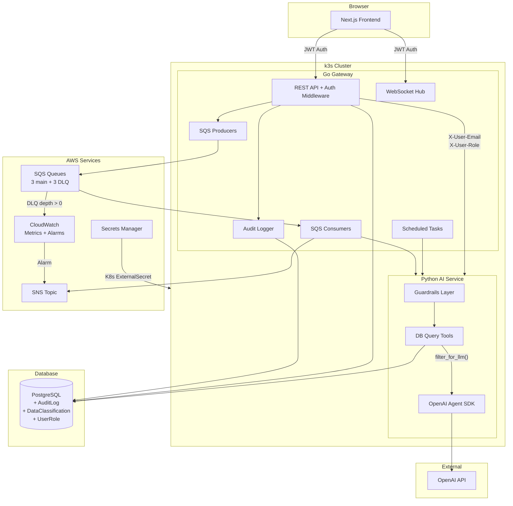
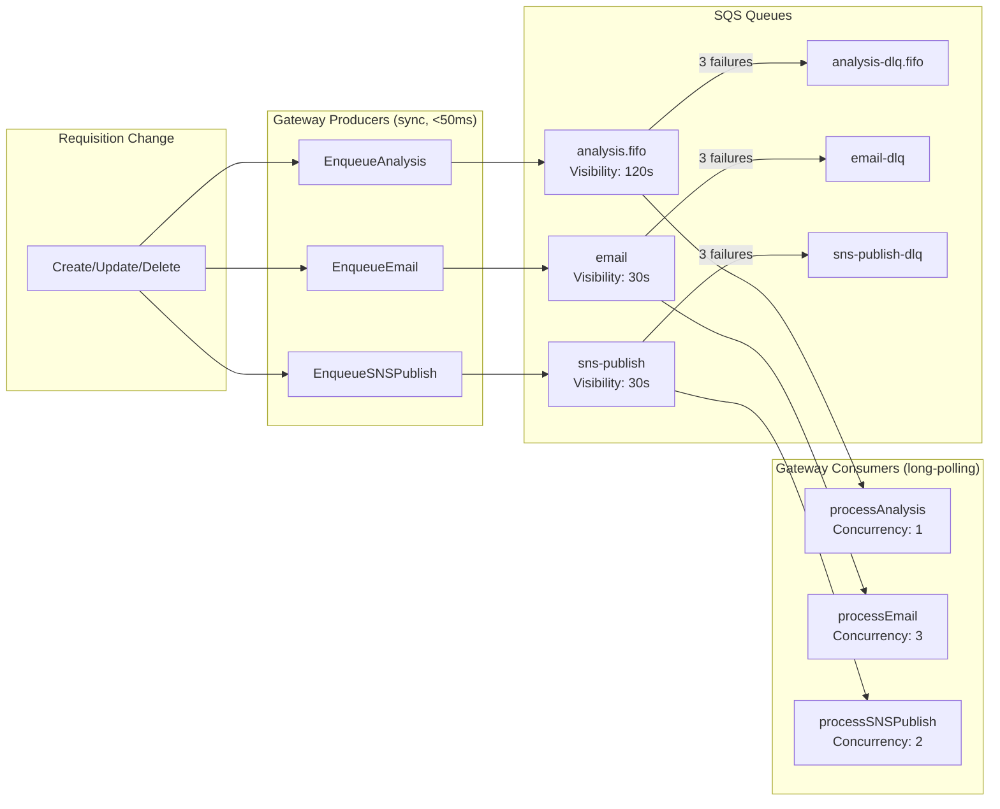
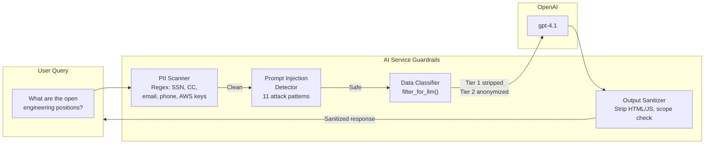
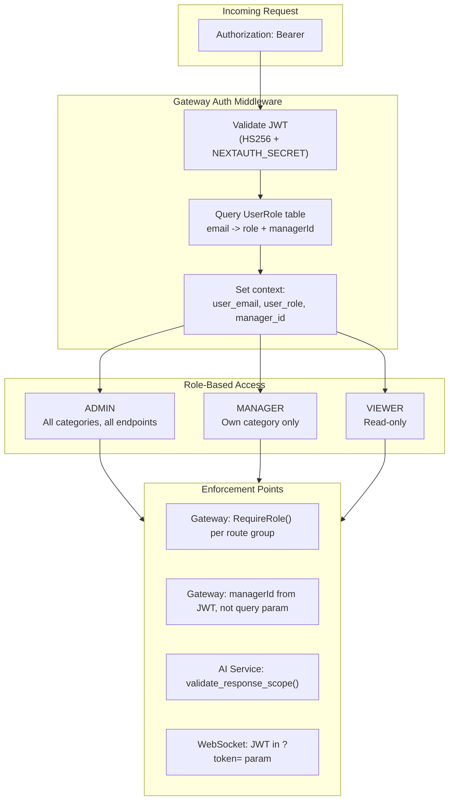

# MetaSource — Intelligent Workforce Sourcing Platform

A platform that helps sourcing managers track contractor hiring requests without any manual effort. When admin edits a hiring request — updates a bill rate, fills a position, changes status — the system instantly detects it and notifies the relevant category manager. When a manager makes changes, admin gets notified. Both sides get real-time WebSocket push, AI-generated summaries, and email alerts. All automatic.

**Live**: [https://meta.callsphere.tech](https://meta.callsphere.tech)

---

## What It Does

Five sourcing managers each own a category of hiring requests (engineering contractors, content & trust/safety, data operations, marketing/creative, corporate services). The platform:

- **Detects every change** — field-level tracking captures exactly what changed, by whom (admin or manager), and when
- **Routes notifications both ways** — admin edits notify the relevant manager; manager edits notify admin
- **Updates dashboards in real time** — WebSocket push means counts and stats refresh instantly, no page reload needed
- **Summarizes with AI** — instead of raw field diffs, managers get plain English summaries like "Bill rate for Senior DevOps increased from $75 to $95/hr"
- **Sends email alerts** — every change triggers an email to the other side via AWS SNS
- **Flags problems automatically** — AI scans for anomalies like price spikes, budget overruns, and stale requests

### What Managers See

| Page | What's There |
|------|-------------|
| **Home** | All 5 managers' active request counts, unfilled positions, and alert badges — updates live via WebSocket |
| **Dashboard** | Stats cards (total requests, unfilled positions, budget, critical priority), category pie chart, status bar chart, recent changes timeline |
| **Hiring Requests** | Full data grid with inline editing, status/priority dropdowns, search, filters, pagination, CSV upload |
| **Notifications** | All alerts with read/unread state, AI-generated summaries |
| **Change Log** | Complete audit trail of every field change across all requests |
| **Market Rates** | Benchmarking data for contractor rates |
| **AI Chat** | Ask questions in plain English — "What are the highest bill rates in engineering?" |

### Admin vs Manager

- **Admin** sees all 5 managers' data, can edit any category, access the data upload pipeline
- **Managers** are auto-redirected to their own dashboard, can only edit their category's requests
- **Notification routing is bidirectional** — when admin edits a request, the relevant category manager gets notified (WebSocket push, in-app notification, and email). When any manager edits a request, admin gets notified in real time via WebSocket. This applies across all 5 managers — every change triggers a notification to the other side

---

## How It Works

### The Change Flow (What Happens When Admin or a Manager Edits a Request)

```
Admin or manager changes status from OPEN to COMPLETED
    |
    v
Go Gateway receives PUT /api/requisitions/:id
    |
    |-- 1. Reads current values from database
    |-- 2. Compares old vs new (field-level diff)
    |-- 3. Saves change record (who, what, when)
    |-- 4. Updates the requisition
    |
    Then fires 4 things in parallel:
        |-- WebSocket broadcast to the category manager + admin (~50ms)
        |-- Creates notification in database for the category manager
        |-- Sends email via AWS SNS (~1-2s)
        |-- Triggers AI anomaly check (~2-5s)
    |
    v
The other side's browser receives WebSocket event
    |-- Dashboard refetches stats (counts drop because COMPLETED is excluded)
    |-- Home page refetches manager cards (same)
    |-- Toast notification appears
    |-- Notification badge increments
```

### Real-Time Updates

Every page that shows data listens for WebSocket events and silently refetches when something changes:

| Page | Listens For | What Refreshes |
|------|-------------|----------------|
| **Home page** | `change`, `notification`, `refresh` | All manager cards, total hiring requests, unfilled positions, alerts count |
| **Dashboard** | `change`, `notification` | All stat cards, charts, recent changes |
| **Hiring Requests** | `change` | Table data, total count, pagination |
| **Notifications** | `notification`, `read` | Notification list, unread badge in sidebar |

The WebSocket hub routes messages correctly:
- A change to an Engineering request goes to the Engineering manager's browser AND all admin browsers
- Admin connections receive events for every manager

### Active Request Counting

The "Total Hiring Requests" and "Unfilled Positions" numbers on both the home page and dashboard **only count active requests**. Requests with status COMPLETED or CANCELLED are excluded from these headline numbers. The status distribution chart on the dashboard still shows all statuses for the full picture.

### AI Features

| Feature | What It Does | When It Runs |
|---------|-------------|--------------|
| **Change Summaries** | Turns "billRateHourly: 75 -> 95" into "Bill rate increased by 27% for Senior DevOps role" | Every 15 minutes (batch) |
| **Anomaly Detection** | Flags rate spikes >10%, budgets >90% used, requests stale >30 days | On each change + daily scan |
| **Chat Assistant** | Answers questions like "Which category has the most unfilled positions?" using 6 database query tools | On demand |
| **Data Upload Pipeline** | Ingests CSV, Excel, JSON, or messy text files — AI cleans and normalizes data | Admin-triggered |

### Email Alerts (AWS SNS)

Every change publishes to an SNS topic. Subscribe any email address via `POST /api/sns/setup` — AWS handles confirmation and delivery. No email server, no SMTP config, no worker process.

---

## Architecture

Three microservices behind Traefik (TLS ingress) on k3s:

```
Browser
  |
  v
Traefik (meta.callsphere.tech:443)
  |
  |-- /api/*  -->  Go Gateway (:8080)
  |-- /ws/*   -->  Go Gateway (:8080)
  |-- /*      -->  Next.js Frontend (:3000)
  |
  v
Go Gateway connects to:
  |-- PostgreSQL (meta_source database)
  |-- Python AI Service (:8000) --> OpenAI API
  |-- AWS SNS (email delivery)
```

### Services

| Service | Technology | Role |
|---------|-----------|------|
| **Frontend** | Next.js 15, TypeScript, Tailwind CSS, shadcn/ui, Recharts | Dashboard UI, data grid, notification center, AI chat, Google OAuth |
| **Gateway** | Go (Gin), Gorilla WebSocket, AWS SNS SDK | All CRUD APIs, real-time WebSocket push, change tracking, notification routing, CSV import, AI proxy |
| **AI Service** | Python (FastAPI), OpenAI Agent SDK (gpt-4.1 / gpt-4.1-mini) | Summarization, anomaly detection, chat Q&A, data cleaning, market rates |
| **Database** | PostgreSQL, Prisma (schema/migrations), raw SQL in Go | All data storage — requisitions, changes, notifications, managers, chat history |

### Database Tables

9 tables in PostgreSQL, managed via Prisma ORM.

**SourcingManager** — 5 managers, each assigned one category

| Column | Type | Notes |
|--------|------|-------|
| id | UUID | PK |
| name | String | |
| email | String | Unique |
| category | RequisitionCategory | Enum |
| avatarUrl | String? | |
| createdAt | DateTime | Default: now |

**Requisition** — Hiring requests

| Column | Type | Notes |
|--------|------|-------|
| id | UUID | PK |
| requisitionId | String | Unique (display ID) |
| team | String | |
| department | String | |
| roleTitle | String | |
| category | RequisitionCategory | Enum |
| headcountNeeded | Int | |
| headcountFilled | Int | Default: 0 |
| vendor | String | |
| billRateHourly | Float | |
| location | String | |
| status | RequisitionStatus | Default: OPEN |
| priority | Priority | Default: MEDIUM |
| budgetAllocated | Float | |
| budgetSpent | Float | Default: 0 |
| startDate | DateTime? | |
| endDate | DateTime? | |
| notes | String? | |
| createdAt | DateTime | Default: now |
| updatedAt | DateTime | Auto-updated |

**RequisitionChange** — Every field change with old/new values, AI summary

| Column | Type | Notes |
|--------|------|-------|
| id | UUID | PK |
| requisitionId | String | FK → Requisition (CASCADE) |
| changeType | ChangeType | Enum |
| fieldChanged | String? | |
| oldValue | String? | |
| newValue | String? | |
| changedBy | String | Default: "system" |
| summary | String? | AI-generated |
| createdAt | DateTime | Default: now |

**Notification** — Per-manager alerts

| Column | Type | Notes |
|--------|------|-------|
| id | UUID | PK |
| managerId | String | FK → SourcingManager (CASCADE) |
| type | NotificationType | Enum |
| title | String | |
| message | String | |
| isRead | Boolean | Default: false |
| metadata | Json? | |
| createdAt | DateTime | Default: now |

**NotificationRule** — Per-manager filtering preferences

| Column | Type | Notes |
|--------|------|-------|
| id | UUID | PK |
| managerId | String | FK → SourcingManager (CASCADE) |
| ruleType | String | |
| threshold | Float? | |
| isEnabled | Boolean | Default: true |
| createdAt | DateTime | Default: now |

**MarketRate** — Contractor rate benchmarks

| Column | Type | Notes |
|--------|------|-------|
| id | UUID | PK |
| roleTitle | String | |
| category | RequisitionCategory | Enum |
| location | String | |
| minRate | Float | |
| maxRate | Float | |
| medianRate | Float | |
| source | String | |
| scrapedAt | DateTime | Default: now |

**ChatSession** — AI chat conversation history

| Column | Type | Notes |
|--------|------|-------|
| id | UUID | PK |
| managerId | String? | |
| messages | Json | Default: [] |
| createdAt | DateTime | Default: now |
| updatedAt | DateTime | Auto-updated |

**AnomalyFingerprint** — 24h dedup for anomaly notifications

| Column | Type | Notes |
|--------|------|-------|
| id | UUID | PK |
| fingerprint | String | Indexed with createdAt |
| category | String | |
| severity | String | |
| managerId | String? | |
| createdAt | DateTime | Default: now |

**ScrapeLog** — Web scraping history

| Column | Type | Notes |
|--------|------|-------|
| id | UUID | PK |
| source | String | |
| rolesScraped | Int | |
| status | String | |
| duration | Int | |
| error | String? | |
| createdAt | DateTime | Default: now |

**Enums**: RequisitionCategory (5 values: ENGINEERING_CONTRACTORS, CONTENT_TRUST_SAFETY, DATA_OPERATIONS, MARKETING_CREATIVE, CORPORATE_SERVICES) · RequisitionStatus (8: OPEN → SOURCING → INTERVIEWING → OFFER → ONBOARDING → ACTIVE → COMPLETED, CANCELLED) · Priority (4: CRITICAL, HIGH, MEDIUM, LOW) · ChangeType (7: CREATED, UPDATED, STATUS_CHANGE, RATE_CHANGE, HEADCOUNT_CHANGE, BUDGET_CHANGE, BULK_IMPORT) · NotificationType (4: CHANGE_SUMMARY, ANOMALY_ALERT, BUDGET_WARNING, MILESTONE)

### Requisition Statuses

OPEN → SOURCING → INTERVIEWING → OFFER → ONBOARDING → ACTIVE → COMPLETED

Requests can also be CANCELLED. Only OPEN through ACTIVE count as "active" in dashboard totals.

### API Endpoints

| Group | Endpoints |
|-------|----------|
| **Requisitions** | GET/POST/PUT/DELETE `/api/requisitions`, POST `/api/requisitions/upload` |
| **Stats & Managers** | GET `/api/stats`, GET `/api/managers`, GET `/api/changes` |
| **Notifications** | GET/PUT `/api/notifications` |
| **SNS** | POST/GET `/api/sns/setup` |
| **AI** | POST `/api/ai/chat`, `/api/ai/summarize`, `/api/ai/analyze`, `/api/ai/detect-changes`, `/api/ai/scrape` |
| **Data Upload** | POST `/api/data-upload`, GET `/api/data-upload/:jobId/status` |

---

## Technical Details

### Why Go for the Gateway

Each requisition update triggers 7 operations (read old values, diff, save change, update row, WebSocket broadcast, create notification, SNS publish). In Go, the async operations are `go func()` — zero infrastructure. In Node.js, you'd need BullMQ + Redis for the same thing.

| Metric | Node.js/Express | Go (Gin) |
|--------|----------------|----------|
| Requests/sec | 5,000–15,000 | 30,000–100,000+ |
| Memory per WebSocket connection | 50–100 KB | 2–4 KB |
| Background async work | Requires job queue + Redis | `go func()` — built in |
| 1,000 WebSocket connections | 50–100 MB RAM | 2–4 MB RAM |

### WebSocket Hub

- Connections register with a `managerId` (or "admin" for admin users)
- On broadcast: sends to the target manager's connections + all admin connections
- Auto-reconnect with exponential backoff on the client side
- Connection cleanup on disconnect

### Field-Level Change Tracking

The `track()` function in `requisitions.go` compares old vs new for each field. No AI — pure string comparison. Each change gets a type: STATUS_CHANGE, RATE_CHANGE, HEADCOUNT_CHANGE, BUDGET_CHANGE, or UPDATED.

### AI Data Upload Pipeline

4 stages for ingesting any file format:

1. **Parse** — Detect format, extract records (structured formats are programmatic; only unstructured text uses AI)
2. **Clean** — AI normalizes values in parallel batches ("eng" → ENGINEERING_CONTRACTORS, "$75/hr" → 75.0)
3. **Validate** — Pydantic schema enforcement (required fields, valid enums, correct types)
4. **Upsert** — Sequential DB insert with audit records and notifications

### Anomaly Deduplication

24-hour fingerprint-based dedup prevents notification spam. Each anomaly is hashed (category + type + key details). Same fingerprint within 24h is suppressed.

### Kubernetes Deployment

Three deployments in namespace `meta-test`. Traefik IngressRoute with TLS via cert-manager. Secrets: `openai-secret`, `aws-secret`.

Resource allocation (small dataset):

| Service | CPU (request/limit) | Memory (request/limit) |
|---------|-------------------|----------------------|
| Frontend | 100m / 500m | 512Mi / 1.5Gi |
| Gateway | 25m / 200m | 128Mi / 256Mi |
| AI Service | 50m / 300m | 256Mi / 512Mi |

### Scaling

| What | How |
|------|-----|
| Add a manager | INSERT one DB row + subscribe their email to SNS |
| Add a category | Add enum value — routing is automatic |
| More requests | PostgreSQL with pagination + indexing handles millions |
| More traffic | `kubectl scale --replicas` — all services are stateless |
| More notification channels | One `go func()` in the gateway — SNS already supports SMS, Lambda, SQS, HTTP |

---

## Project Structure

```
meta_test/
  frontend/       Next.js app (UI, Prisma schema, API routes for local dev)
  gateway/        Go API server (all production API endpoints, WebSocket, SNS)
  ai-service/     Python FastAPI (OpenAI agents, anomaly detection, chat)
  k8s/            Kubernetes deployment + ingress YAML
```

---

## AWS Infrastructure — Reliability, Compliance & Guardrails

The platform uses AWS services for reliable async processing, monitoring, data compliance, and security. No Airflow — the complexity doesn't justify it at current scale. SQS + CloudWatch + gateway-native scheduling provides the same reliability with fewer moving parts.

### Architecture — AWS Services Integration



### SQS Queues — Replacing Fire-and-Forget Goroutines

Every async operation now flows through SQS with automatic retry (3x) and dead-letter queues.

| Queue | Type | What It Processes | DLQ |
|-------|------|-------------------|-----|
| `metasource-analysis.fifo` | FIFO | AI anomaly detection per category (serialized by MessageGroupId) | `metasource-analysis-dlq.fifo` |
| `metasource-email` | Standard | Email notifications to managers via AI service | `metasource-email-dlq` |
| `metasource-sns-publish` | Standard | SNS change event publishing | `metasource-sns-publish-dlq` |



### Scheduled Tasks — Replacing Python Crons

Timer-based goroutines in the gateway replace the Python `asyncio.sleep` loops. Same reliability, proper error handling, CloudWatch metrics on every execution.

| Task | Interval | What It Does |
|------|----------|-------------|
| Summarization | Every 15 min | Calls AI service to detect unsummarized changes, generate plain English summaries |
| Anomaly Scan | Every 1 hour | Iterates all 5 categories, runs anomaly detection, deduplicates, creates notifications |

### CloudWatch Monitoring

| Alarm | Triggers When | Action |
|-------|--------------|--------|
| `*-dlq-not-empty` (x3) | Any DLQ has >= 1 message for 5 min | SNS email alert |
| `*-queue-backlog` (x3) | Any main queue > 100 messages for 5 min | SNS email alert |
| Custom: `TaskFailure` | Scheduled task fails | Logged + metric |
| Custom: `ProcessingDuration` | Per-message processing time | Dashboard metric |

### Data Compliance — 3-Tier Classification

Every field in the database has a classification tier stored in the `DataClassification` table. The AI service's `filter_for_llm()` function enforces these tiers before any data reaches OpenAI.

| Tier | Rule | Fields |
|------|------|--------|
| **TIER1_NEVER_LLM** | Stripped entirely before LLM call | `billRateHourly`, `budgetAllocated`, `budgetSpent`, `vendor`, `notes`, `MarketRate.min/max/medianRate` |
| **TIER2_ANONYMIZE** | Replaced with ranges/buckets | `headcountNeeded` (5 -> "1-10"), `headcountFilled` |
| **TIER3_SAFE** | Passed unchanged | `requisitionId`, `roleTitle`, `category`, `status`, `priority`, `location`, `team`, `department` |



### RBAC — Server-Side Authorization



### Audit Trail

Every API call is logged to the `AuditLog` table with:
- **Who**: User email + role (from JWT, not hardcoded "admin")
- **What**: Action type (DATA_READ, DATA_WRITE, AI_QUERY, FILE_UPLOAD, AUTH_FAILURE, RBAC_DENIED)
- **Where**: Resource + resource ID + HTTP method + path
- **When**: Timestamp + duration in ms
- **Correlation**: `X-Request-ID` propagated across all 3 services

The audit middleware uses a buffered Go channel with batch INSERTs (50 entries or 5 seconds) so it never slows down API responses.

### Secrets Management

All credentials are stored in AWS Secrets Manager and synced to K8s via External Secrets Operator:

| Secret | Source | K8s Secret |
|--------|--------|-----------|
| Database credentials | `meta-source/prod` | `db-secret` |
| NextAuth + Google OAuth | `meta-source/prod` | `auth-secret` |
| SMTP credentials | `meta-source/prod` | `smtp-secret` |
| OpenAI API key | `openai-secret` (existing) | `openai-secret` |
| AWS credentials | `aws-secret` (existing) | `aws-secret` |

No hardcoded credentials in code or environment variables. Services fail fast if secrets are missing.

### Security Hardening Summary

| Control | Before | After |
|---------|--------|-------|
| **CORS** | `*` (any origin) | `meta.callsphere.tech` + `localhost:3000` only |
| **Auth** | None on gateway | NextAuth JWT validation on every endpoint |
| **RBAC** | Frontend email check | Server-side UserRole table + RequireRole() middleware |
| **Rate Limiting** | 100 req/s global | Per-user: 30/min for AI chat, 5/min for uploads, 100/min default |
| **PII** | Raw data to OpenAI | Regex scanner strips SSN, CC, phone, email, AWS keys |
| **Prompt Injection** | None | 11 attack patterns blocked |
| **Data Classification** | All fields to LLM | 3-tier system: pricing/budgets never reach LLM |
| **Audit** | `changedBy: "admin"` | Full audit log with user identity, correlation IDs |
| **Credentials** | Hardcoded `postgres:postgres` | AWS Secrets Manager + fail-fast on missing env vars |
| **WebSocket** | No auth, user-supplied managerId | JWT auth, server-derived managerId |
