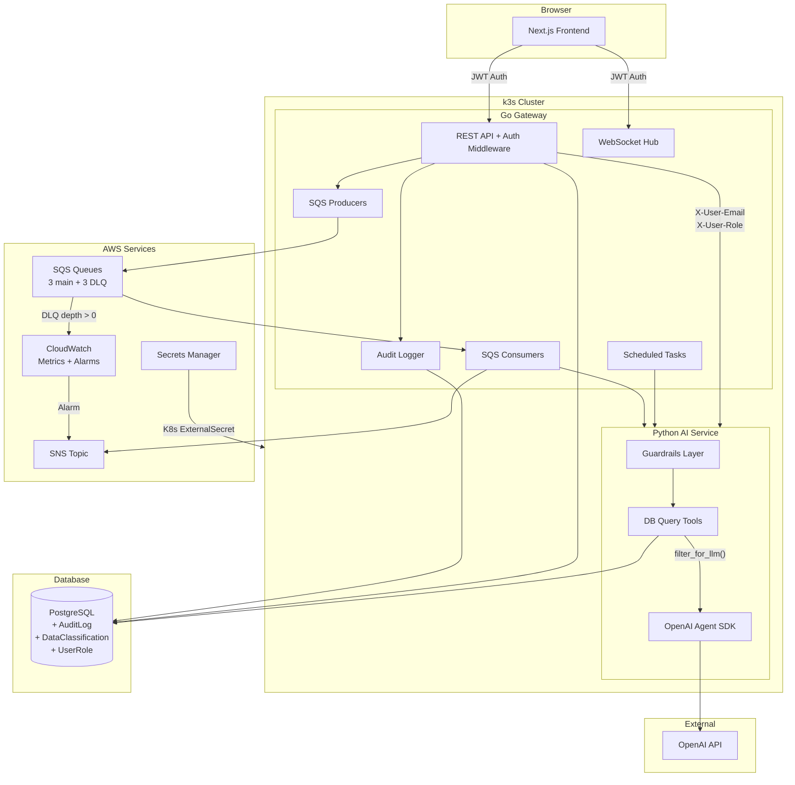
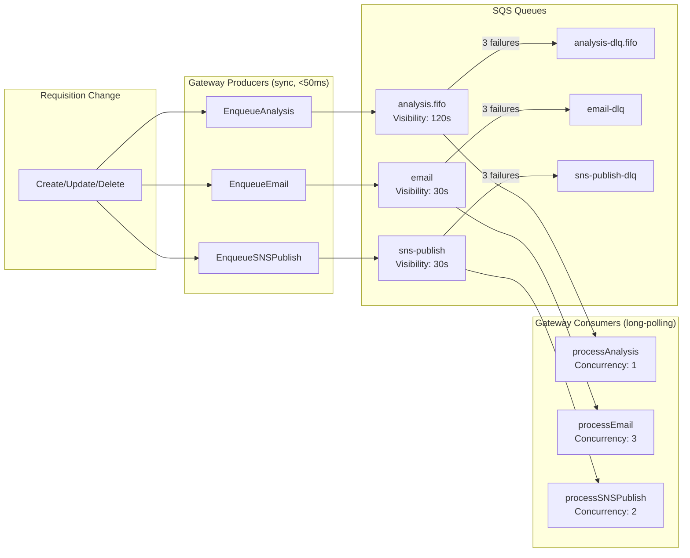
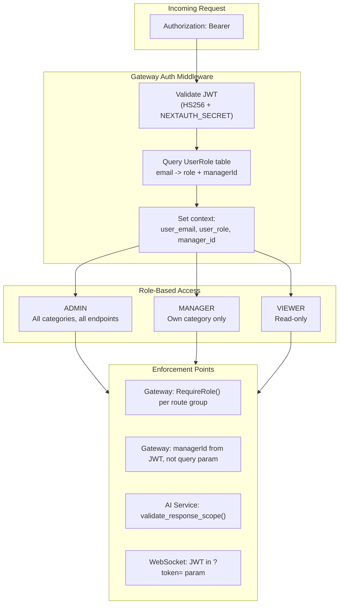
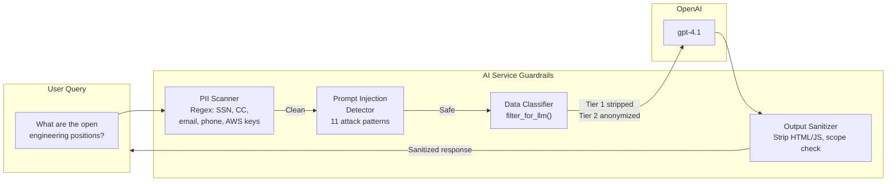

# MetaSource — Intelligent Workforce Sourcing Platform

A platform that automates change detection, notifications, and analysis for contractor hiring requests. When an admin or manager edits a request, the system detects it, notifies the other side in real time, generates AI summaries, sends email alerts, and flags anomalies. All automatic.

**Live**: [https://meta.callsphere.tech](https://meta.callsphere.tech)

---

## What It Does

Five sourcing managers each own a category (Engineering, Content & Trust/Safety, Data Operations, Marketing/Creative, Corporate Services). The platform:

- **Tracks every change** — field-level diffs capture what changed, by whom, and when
- **Routes notifications bidirectionally** — admin edits notify the manager; manager edits notify admin
- **Pushes updates in real time** — WebSocket refreshes dashboards instantly
- **Summarizes with AI** — plain English summaries like "Bill rate for Senior DevOps increased from $75 to $95/hr"
- **Sends email alerts** — every change triggers an email via AWS SNS
- **Flags anomalies** — AI detects rate spikes, budget overruns, and stale requests

### Pages

| Page | Purpose |
|------|---------|
| **Home** | 5 manager cards with live metrics (active requests, unfilled positions, alerts) |
| **Dashboard** | Stats cards, category pie chart, status bar chart, recent changes |
| **Hiring Requests** | Data grid with inline editing, filters, pagination, CSV upload |
| **Notifications** | Alerts with read/unread state and AI summaries |
| **Change Log** | Full audit trail of every field change |
| **Market Rates** | Contractor rate benchmarks by role/location |
| **AI Chat** | Natural language Q&A — "What are the highest bill rates in engineering?" |

### Roles

| Role | Access |
|------|--------|
| **Admin** | All categories, all endpoints, data upload, manager config |
| **Manager** | Own category only — auto-redirected to their dashboard |
| **Viewer** | Read-only |

---

## How It Works

### Change Flow

```
Admin or manager changes status from OPEN to COMPLETED
    |
    v
Go Gateway receives PUT /api/requisitions/:id
    |
    |-- 1. Reads current values from database
    |-- 2. Compares old vs new (field-level diff)
    |-- 3. Saves change record (who, what, when)
    |-- 4. Updates the requisition
    |
    Then fires 4 things in parallel:
        |-- WebSocket broadcast to the category manager + admin (~50ms)
        |-- Creates notification in database for the category manager
        |-- Sends email via AWS SNS (~1-2s)
        |-- Triggers AI anomaly check (~2-5s)
    |
    v
The other side's browser receives WebSocket event
    |-- Dashboard refetches stats (counts drop because COMPLETED is excluded)
    |-- Home page refetches manager cards (same)
    |-- Toast notification appears
    |-- Notification badge increments
```

### Real-Time WebSocket Events

| Page | Listens For | What Refreshes |
|------|-------------|----------------|
| **Home** | `change`, `notification`, `refresh` | Manager cards, request counts, alerts |
| **Dashboard** | `change`, `notification` | Stats, charts, recent changes |
| **Hiring Requests** | `change` | Table data, pagination |
| **Notifications** | `notification`, `read` | Notification list, unread badge |

The WebSocket hub routes by role: manager connections get their own category events; admin connections get all events.

### AI Features

| Feature | What It Does | When |
|---------|-------------|------|
| **Change Summaries** | "billRateHourly: 75 → 95" becomes "Bill rate increased 27% for Senior DevOps" | Every 15 min |
| **Anomaly Detection** | Flags rate spikes >10%, budgets >90%, stale requests >30 days | On each change + hourly scan |
| **Chat Assistant** | Answers questions using 6 database query tools | On demand |
| **Data Upload** | Ingests CSV/Excel/JSON — AI cleans and normalizes | Admin-triggered |

### Active Request Counting

Dashboard totals only count active statuses (OPEN through ACTIVE). COMPLETED and CANCELLED are excluded from headline numbers but appear in the status distribution chart.

---

## Architecture

```
Browser
  |
  v
Traefik (meta.callsphere.tech:443)
  |
  |-- /api/*  -->  Go Gateway (:8080)
  |-- /ws/*   -->  Go Gateway (:8080)
  |-- /*      -->  Next.js Frontend (:3000)
  |
  v
Go Gateway connects to:
  |-- PostgreSQL (meta_source database)
  |-- Python AI Service (:8000) --> OpenAI API
  |-- AWS SNS (email delivery)
```

### Services

| Service | Stack | Role |
|---------|-------|------|
| **Frontend** | Next.js 15, TypeScript, Tailwind, shadcn/ui, Recharts | UI, auth, data grid, charts |
| **Gateway** | Go (Gin), Gorilla WebSocket, AWS SDK | APIs, WebSocket, change tracking, SQS, SNS |
| **AI Service** | Python (FastAPI), OpenAI Agent SDK | Summarization, anomaly detection, chat, data cleaning |
| **Database** | PostgreSQL, Prisma (schema/migrations) | All data storage |



---

## SQS Queues

Every async operation flows through SQS with automatic retry (3x) and dead-letter queues.

| Queue | Type | Purpose | Concurrency | DLQ |
|-------|------|---------|-------------|-----|
| `metasource-analysis.fifo` | FIFO | AI anomaly detection per category | 1 | `metasource-analysis-dlq.fifo` |
| `metasource-email` | Standard | Email notifications to managers | 3 | `metasource-email-dlq` |
| `metasource-sns-publish` | Standard | SNS change event publishing | 2 | `metasource-sns-publish-dlq` |



### Scheduled Tasks

| Task | Interval | Purpose |
|------|----------|---------|
| Summarization | 15 min | Detect unsummarized changes, generate AI summaries |
| Anomaly Scan | 1 hour | Run anomaly detection across all 5 categories |

---

## Security & Compliance

### RBAC



### Data Compliance — 3-Tier Classification

Every field has a classification tier enforced by `filter_for_llm()` before data reaches OpenAI.

| Tier | Rule | Fields |
|------|------|--------|
| **TIER1_NEVER_LLM** | Stripped entirely | `billRateHourly`, `budgetAllocated`, `budgetSpent`, `vendor`, `notes`, `MarketRate.*Rate` |
| **TIER2_ANONYMIZE** | Replaced with ranges | `headcountNeeded` (5 → "1-10"), `headcountFilled` |
| **TIER3_SAFE** | Passed unchanged | `requisitionId`, `roleTitle`, `category`, `status`, `priority`, `location` |



### Audit Trail

Every API call is logged to the `AuditLog` table: user email + role, action type (DATA_READ, DATA_WRITE, AI_QUERY, FILE_UPLOAD, AUTH_FAILURE, RBAC_DENIED), resource, HTTP method, path, duration, and correlation ID. Uses buffered batch INSERTs (50 entries or 5s) to avoid slowing responses.

### Security Controls

| Control | Implementation |
|---------|---------------|
| **CORS** | Restricted to `meta.callsphere.tech` + `localhost:3000` |
| **Auth** | NextAuth JWT (HS256) validated on every endpoint |
| **RBAC** | Server-side `UserRole` table + `RequireRole()` middleware |
| **Rate Limiting** | Per-user: 30/min AI chat, 5/min uploads, 100/min default |
| **PII Scanning** | Regex strips SSN, CC, phone, email, AWS keys before LLM |
| **Prompt Injection** | 11 attack patterns blocked |
| **Credentials** | AWS Secrets Manager + fail-fast on missing env vars |
| **WebSocket Auth** | JWT in `?token=` param, server-derived managerId |

### Current vs. Future: Enterprise Compliance Pipeline

The platform currently uses **homegrown guardrails** — regex PII scanning, a DB-driven data classifier, hardcoded RBAC middleware, and rule-based output sanitization. These work but have limitations: regex misses context-dependent PII, classification rules are manual, and policy changes require code deploys.

The target architecture replaces these with four enterprise tools wired into a single pipeline:

```
User/AI query
  → Apache Ranger    (access control gateway — "can this user access this resource?")
  → OpenMetadata     (data catalog — "what sensitivity tags does this field have?")
  → OPA              (policy engine — "given these tags and this role, what's allowed?")
  → Presidio         (PII masking — "redact any personal data before returning")
  → Safe response
```

#### Tool Mapping

| Current (Homegrown) | Future (Enterprise) | What Changes |
|---------------------|---------------------|-------------|
| `guardrails/pii_scanner.py` — regex patterns for SSN, CC, email, phone, AWS keys | **Microsoft Presidio** — ML-based NER with spaCy models. Catches context-dependent PII that regex misses (names, addresses, medical terms) | Presidio runs as 2 sidecars (analyzer + anonymizer) in the AI pod. Same `redact_text()` interface, falls back to regex if Presidio is down |
| `guardrails/data_classifier.py` + `DataClassification` table — manual tier assignments per field | **OpenMetadata** — data catalog with column-level tags. Classification lives in the catalog, not a flat DB table | Tags managed via OpenMetadata UI instead of raw SQL. `filter_for_llm()` reads tags via REST API with 5-min cache |
| `middleware/auth.go` + `RequireRole()` + `checkManagerAuth()` — hardcoded Go role checks | **OPA (Open Policy Agent)** — policy-as-code in Rego. Role/route/category rules are declarative, not compiled into the binary | OPA runs as a sidecar in the gateway pod. Policy changes = update a ConfigMap, no redeploy |
| Go middleware as the authorization layer | **Apache Ranger** — centralized access control that reads OpenMetadata tags and delegates to OPA for policy evaluation | Ranger becomes the single authz decision point. Gateway still validates JWT but delegates all authorization to Ranger |

#### Architecture Comparison

**Current:**
```
Request → JWT auth (Go) → hardcoded RequireRole (Go) → handler queries DB
                                                          → data_classifier strips/anonymizes fields
                                                          → pii_scanner regex-redacts input
                                                          → output_sanitizer checks scope
```

**Future:**
```
Request → JWT auth (Go, kept)
        → Ranger middleware (Go → Ranger REST API)
            → Ranger reads OpenMetadata tags for the resource
            → Ranger evaluates OPA policies (role + tags + category)
            → Returns allow/deny + field-level conditions
        → Handler queries DB
            → OpenMetadata client filters by tag tiers (replaces data_classifier)
            → Presidio ML-redacts PII (replaces regex scanner)
            → prompt_guard.py injection check (kept, no enterprise replacement)
            → output_sanitizer XSS/SQL strip (kept, no enterprise replacement)
```

#### Phased Rollout

| Phase | Tool | Deploys As | Effort | Risk |
|-------|------|-----------|--------|------|
| 1 | **OPA** | Sidecar in gateway pod | Medium | Low — stateless, easy rollback |
| 2 | **Presidio** | 2 sidecars in AI pod | Low-Medium | Low — drop-in with fallback |
| 3 | **OpenMetadata** | Separate deployment + Elasticsearch | High | Medium — new stateful infra |
| 4 | **Apache Ranger** | Separate deployment | High | High — replaces core authz |

Phases 1+2 can run in parallel. Phase 3 must precede Phase 4 (Ranger needs OpenMetadata tags).

#### Trade-offs

| | Homegrown (Current) | Enterprise Tools (Future) |
|---|---|---|
| **Setup complexity** | Zero — already running | High — 4 new services, ~3x cluster resources |
| **PII accuracy** | Regex only — misses names, addresses, context-dependent data | ML-based NER — catches entity types regex can't |
| **Policy changes** | Requires code change + redeploy | Update Rego file or Ranger UI — no redeploy |
| **Data classification** | Manual SQL inserts in `DataClassification` table | Visual UI in OpenMetadata, version-controlled tags |
| **Operational overhead** | Minimal — just Go + Python | Significant — OPA, Presidio, OpenMetadata (+ ES), Ranger each need monitoring |
| **Resource footprint** | ~2 GB total across 3 pods | ~6 GB total — OpenMetadata + Ranger are Java/memory-heavy |
| **Compliance audit** | Homegrown audit log, no standard format | Ranger provides built-in audit with standard formats |
| **Vendor lock-in** | None — all custom code | Low — all open-source (Apache/Microsoft), but migration effort is real |
| **Team expertise** | Go + Python (already have) | Adds Rego (OPA), Java config (Ranger), OpenMetadata admin |
| **Failure modes** | Code bugs → fix and deploy | Service outages → need fallback paths for each tool |
| **Time to production** | Already there | 4-6 weeks for a team of 2 |

**Bottom line:** The homegrown approach is fine for the current scale. The enterprise stack is worth it when: (a) compliance/audit requirements demand industry-standard tooling, (b) policy changes need to happen without code deploys, or (c) PII detection accuracy is critical (healthcare, finance, legal data).

---

## Database

9 tables managed via Prisma. Key tables:

| Table | Purpose |
|-------|---------|
| **SourcingManager** | 5 managers, each assigned one category |
| **Requisition** | Hiring requests with status, priority, budget, rates |
| **RequisitionChange** | Every field change with old/new values + AI summary |
| **Notification** | Per-manager alerts with read/unread state |
| **NotificationRule** | Per-manager notification preferences |
| **MarketRate** | Contractor rate benchmarks |
| **ChatSession** | AI chat conversation history |
| **AnomalyFingerprint** | 24h dedup for anomaly notifications |
| **ScrapeLog** | Web scraping history |

Additional tables: `AuditLog` (API call logging), `DataClassification` (field-level tiers), `UserRole` (email → role + managerId).

### Enums

- **RequisitionCategory**: ENGINEERING_CONTRACTORS, CONTENT_TRUST_SAFETY, DATA_OPERATIONS, MARKETING_CREATIVE, CORPORATE_SERVICES
- **RequisitionStatus**: OPEN → SOURCING → INTERVIEWING → OFFER → ONBOARDING → ACTIVE → COMPLETED / CANCELLED
- **Priority**: CRITICAL, HIGH, MEDIUM, LOW
- **ChangeType**: CREATED, UPDATED, STATUS_CHANGE, RATE_CHANGE, HEADCOUNT_CHANGE, BUDGET_CHANGE, BULK_IMPORT
- **NotificationType**: CHANGE_SUMMARY, ANOMALY_ALERT, BUDGET_WARNING, MILESTONE

Only OPEN through ACTIVE count as "active" in dashboard totals.

### API Endpoints

| Group | Endpoints |
|-------|----------|
| **Requisitions** | GET/POST/PUT/DELETE `/api/requisitions`, POST `/api/requisitions/upload` |
| **Stats & Managers** | GET `/api/stats`, GET `/api/managers`, GET `/api/changes` |
| **Notifications** | GET/PUT `/api/notifications` |
| **SNS** | POST/GET `/api/sns/setup` |
| **AI** | POST `/api/ai/chat`, `/api/ai/summarize`, `/api/ai/analyze`, `/api/ai/detect-changes`, `/api/ai/scrape` |
| **Data Upload** | POST `/api/data-upload`, GET `/api/data-upload/:jobId/status` |

---

## Project Structure

```
meta_test/
├── frontend/                       Next.js 15 — Dashboard UI, auth, Prisma schema
│   ├── app/                        App Router pages and components
│   │   ├── page.tsx                Home page — 5 manager cards with live metrics
│   │   ├── layout.tsx              Root layout — sidebar nav, auth guard, providers
│   │   ├── providers.tsx           Context providers (NextAuth, WebSocket, toasts)
│   │   ├── dashboard/page.tsx      Stats cards, pie/bar charts, recent changes
│   │   ├── requisitions/
│   │   │   ├── page.tsx            Data grid — inline editing, filters, pagination
│   │   │   ├── upload/page.tsx     CSV/JSON/Excel file uploader with progress
│   │   │   └── components/         Table, form, and filter bar components
│   │   ├── notifications/page.tsx  Notification center with read/unread state
│   │   ├── changes/page.tsx        Full audit trail of field-level changes
│   │   ├── market-intel/page.tsx   Contractor rate benchmarks by role/location
│   │   ├── chat/page.tsx           AI chat — natural language Q&A with data
│   │   ├── architecture/page.tsx   System architecture documentation page
│   │   ├── components/ui/          Reusable UI components (shadcn/ui design system)
│   │   └── api/                    Next.js API routes (proxy to Go gateway)
│   │       ├── auth/[...nextauth]/ Google OAuth via NextAuth
│   │       ├── requisitions/       CRUD proxy to gateway
│   │       ├── ai/chat/            AI chat proxy to gateway
│   │       └── ...                 Stats, managers, notifications, etc.
│   ├── lib/                        Shared utilities
│   │   ├── prisma.ts               Prisma ORM client singleton
│   │   ├── utils.ts                Helper functions (formatting, calculations)
│   │   ├── managers.ts             Manager config (5 categories, colors, icons)
│   │   ├── sns.ts                  AWS SNS client initialization
│   │   ├── use-websocket.ts        WebSocket hook with auto-reconnect
│   │   └── ws-context.tsx          React context for WebSocket state
│   └── prisma/
│       ├── schema.prisma           Database schema (9 tables, enums)
│       ├── migrations/             SQL migration files
│       └── seed.ts                 Initial data — 5 sourcing managers
│
├── gateway/                        Go (Gin) — API Gateway, WebSocket, SQS
│   ├── main.go                     Entrypoint — router setup, middleware, graceful shutdown
│   ├── db/
│   │   └── postgres.go             PostgreSQL connection pool initialization
│   ├── handlers/                   HTTP request handlers
│   │   ├── requisitions.go         CRUD for hiring requests + field-level change tracking
│   │   ├── websocket.go            WebSocket hub — per-manager connections, broadcast routing
│   │   ├── stats.go                Dashboard statistics aggregation
│   │   ├── managers.go             List sourcing managers
│   │   ├── notifications.go       In-app notification management
│   │   ├── changes.go              Change log endpoint
│   │   ├── market_rates.go         Contractor rate benchmarks
│   │   ├── ai_proxy.go             Proxy requests to Python AI service
│   │   ├── data_upload.go          Admin file upload pipeline trigger
│   │   ├── upload.go               Legacy CSV import handler
│   │   ├── sns.go                  AWS SNS topic setup and status
│   │   ├── health.go               Health check for gateway + AI service
│   │   ├── sqs.go                  SQS client, queue creation (3 main + 3 DLQ)
│   │   ├── sqs_consumers.go        Long-polling consumers for async processing
│   │   ├── auto_analyze.go         Trigger AI anomaly analysis on changes
│   │   ├── cloudwatch.go           CloudWatch alarm setup for queue monitoring
│   │   └── eventbridge.go          Optional scheduled task trigger
│   └── middleware/                  Request processing pipeline
│       ├── auth.go                  JWT validation + RBAC (admin/manager/viewer)
│       ├── cors.go                  CORS origin restriction
│       ├── logging.go               Structured JSON request logging
│       ├── ratelimit.go             Per-user, per-route rate limiting
│       ├── recovery.go              Panic recovery to prevent crashes
│       └── audit.go                 Audit trail — logs every API call to database
│
├── ai-service/                     Python (FastAPI) — AI/ML Operations
│   ├── main.py                     FastAPI app — all AI endpoints, scheduled tasks
│   ├── ai_agents/                  OpenAI Agent SDK integrations
│   │   ├── query_agent.py          Natural language Q&A with 6 database tools
│   │   ├── anomaly_detector.py     Detects rate spikes, budget overruns, stale requests
│   │   ├── summarizer.py           Converts field diffs to plain English via GPT
│   │   ├── change_detector.py      Finds unsummarized changes (pure Python, no AI)
│   │   ├── upload_pipeline.py      4-stage ingest: parse → clean → validate → upsert
│   │   ├── upload_parser.py        File format detection and record extraction
│   │   ├── upload_cleaner.py       AI-powered data normalization in parallel batches
│   │   └── upload_models.py        Pydantic models for pipeline records
│   ├── guardrails/                 Security & compliance enforcement
│   │   ├── data_classifier.py      3-tier classification (NEVER_LLM/ANONYMIZE/SAFE)
│   │   ├── pii_scanner.py          Regex detection of SSN, credit cards, emails, etc.
│   │   ├── prompt_guard.py         Prompt injection attack pattern detection
│   │   ├── output_sanitizer.py     Strips HTML/JS/SQL from LLM responses
│   │   └── file_validator.py       File upload validation (type, size, content scan)
│   ├── tools/
│   │   └── db_tools.py             Database query tools for AI agents
│   ├── scrapers/
│   │   ├── rate_scraper.py         Market rate data generation/scraping
│   │   └── data_generator.py       Sample hiring data generator for testing
│   ├── anomaly_dedup.py            24h fingerprint dedup for anomaly notifications
│   ├── email_notifier.py           Email dispatch to managers via SMTP/SES
│   └── logging_config.py           Structured JSON logging configuration
│
├── k8s/                            Kubernetes manifests for k3s deployment
│   ├── namespace.yaml              meta-test namespace isolation
│   ├── deployment.yaml             3 deployments (frontend, gateway, ai-service)
│   ├── services.yaml               ClusterIP services for internal routing
│   ├── ingress.yaml                Traefik HTTPS routing with TLS (Let's Encrypt)
│   ├── secrets.yaml                API keys and credentials (dev fallback)
│   ├── create-secrets.sh           Script to create K8s secrets from env vars
│   └── external-secret.yaml        AWS Secrets Manager sync via ESO (production)
│
├── .github/
│   └── workflows/
│       └── ci.yml                  CI/CD pipeline (Go tests, Python tests, frontend build, K8s validation)
│
├── docs/                           Documentation and interview prep materials
└── README.md                       This file
```

---

## CI/CD

GitHub Actions pipeline runs on every push and PR to `main`:

| Job | What It Does |
|-----|-------------|
| **Gateway Tests** | `go test -race ./...` + binary build (Go 1.24) |
| **AI Service Tests** | `pytest tests/` (Python 3.12) |
| **Frontend Build** | `npm run lint` + `npm run build` (Node 20) |
| **Docker Build Check** | Validates all K8s YAML manifests (runs after all tests pass, main branch only) |

---

## Deployment

Three deployments on k3s in namespace `meta-test`. Traefik IngressRoute with TLS via cert-manager (Let's Encrypt). Secrets synced from AWS Secrets Manager via External Secrets Operator.

| Service | CPU (req/limit) | Memory (req/limit) |
|---------|----------------|-------------------|
| Frontend | 100m / 500m | 512Mi / 1.5Gi |
| Gateway | 25m / 200m | 128Mi / 256Mi |
| AI Service | 50m / 300m | 256Mi / 512Mi |

### Scaling

| What | How |
|------|-----|
| Add a manager | INSERT one DB row + subscribe email to SNS |
| Add a category | Add enum value — routing is automatic |
| More requests | PostgreSQL pagination + indexing handles millions |
| More traffic | `kubectl scale --replicas` — all services are stateless |
| More channels | One `go func()` — SNS supports SMS, Lambda, SQS, HTTP |

---

## Why Go for the Gateway

Each update triggers 7 operations (read, diff, save change, update, WebSocket, notification, SNS). In Go, async work is `go func()` — no job queue needed.

| Metric | Node.js/Express | Go (Gin) |
|--------|----------------|----------|
| Requests/sec | 5,000–15,000 | 30,000–100,000+ |
| Memory per WebSocket | 50–100 KB | 2–4 KB |
| Background async | Requires job queue + Redis | `go func()` built in |
| 1,000 WebSocket connections | 50–100 MB | 2–4 MB |

---

## CloudWatch Monitoring

| Alarm | Trigger | Action |
|-------|---------|--------|
| `*-dlq-not-empty` (x3) | DLQ has >= 1 message for 5 min | SNS email alert |
| `*-queue-backlog` (x3) | Queue > 100 messages for 5 min | SNS email alert |
| `TaskFailure` | Scheduled task fails | Logged + metric |
| `ProcessingDuration` | Per-message processing time | Dashboard metric |
